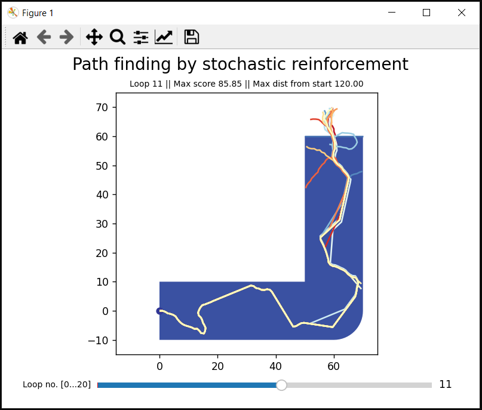
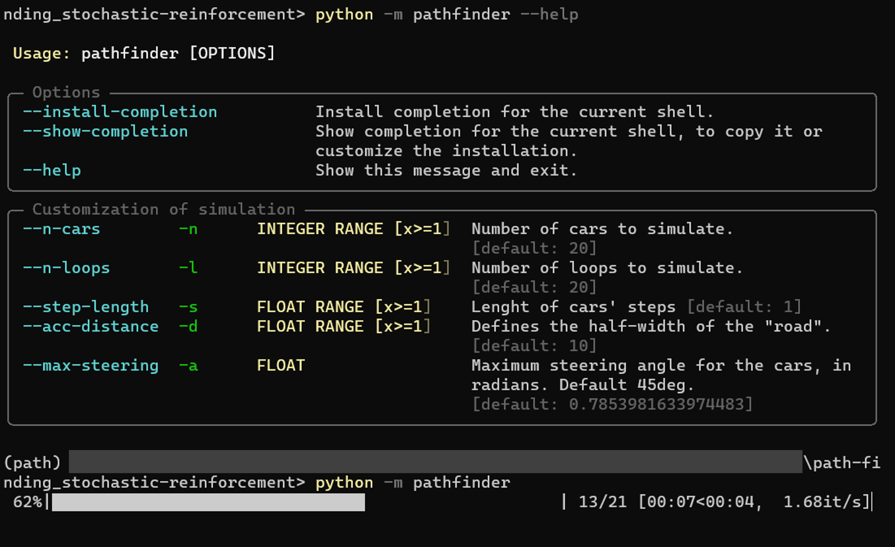

# Path-finding with Stochastic reinforcement

This is an experience of automated learning by using a strategy driven by stochastic generation of solution and positive reinforcement.



## Framework & Usage

It takes the analogy of cars driving on a pre-defined track.
3 classes make this framework:
- The track, class name TheRightRoute
- The strategy, example class name FinderStrategy_1. This is a basic strategy that can be refined. Feel free to suggest additional ones.
- The experiment manager, class name PathFinder

To run the experience:
```bash
python -m pathfinder
```

To get help:
```bash
python -m pathfinder --help
```



Or open the main notebook and run the cell.

## Requirements
Developed on Python 3.10. 
Conda environment can be imported from env.yml.

Non-standard packages used:
- numpy
- pandas
- tqdm
- shapely
- matplotlib
- geopandas
- ipywidgets (for notebook usage only)

## Contributing

You found this repo and you like it? Feel free to get in touch or to raise an issue!
Pull requests are welcome. For major changes, please open an issue first to discuss what you would like to change.

